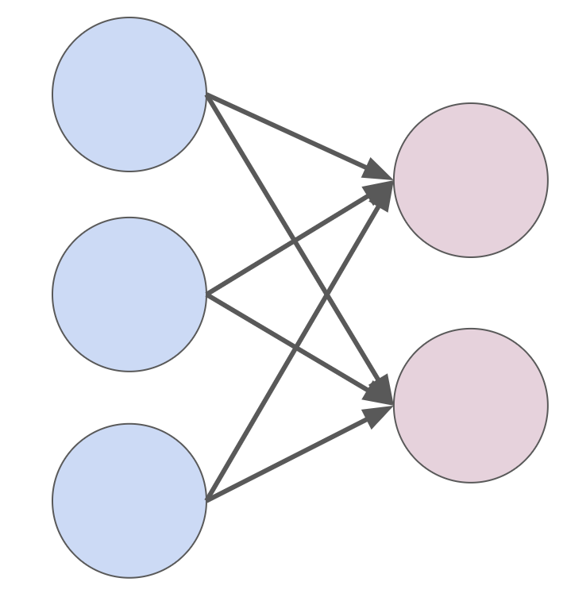

# Dense
[github link](https://github.com/colecgulino/numpy-nn/blob/main/nn/dense.py)

The simplest layer we can imagine is a simple Feedforward Linear layer which we call a `Dense` module in the library.



The signature of the layer initialization is:
```python
def __init__(
        self,
        in_dim: int,
        out_dim: int,
        use_bias: bool = True,
        name: str = 'Dense'
) -> None:
```

## Forward pass
The parameters of the `Dense` layer are a weight parameter `W` and bias parameter `b`. The weight matrix `W` maps the input of the module to the output space and is of shape `[in_dim, out_dim]`. The bias is a parameter of shape `[out_dim]` which adds some bias values to the output after the weight matrix is applied.

The forward pass of the network is very simple:
$$
Y = XW + b
$$

For a simple input $x = [x_1, x_2]$ and parameters:
$$
W = \begin{bmatrix}
w_{11} & w_{12} \\
w_{21} & w_{22}
\end{bmatrix}
$$
$$
b = [b_1, b_2]
$$

The output of the module then:
$$
Y.T = \begin{bmatrix}
x_1w_{11} + x_2w_{21} + b_1 \\
x_1w_{12} + x_2w_{22} + b_2
\end{bmatrix}
$$

In Pytorch, we can write this as:
```python
x = x @ self.W + self.b
```

## Backward Pass

We assume that we have some output from the layer that follows the current one which is of the form:
$$
\frac{\partial L}{\partial Y} \in \mathbb{R}^{b\times d}
$$

For a `Dense` laye we want to calculate a specific set of of quantities related to the loss $L$.

Let:
$$
X \in \mathbb{R}^{b\times c}; \space W \in \mathbb{R}^{c\times d} ; \space b \in \mathbb{R}^{d}
$$

Then we want to find two quantities during the backward pass:
$$
\frac{\partial L}{\partial W} \in \mathbb{R}^{c\times d}; \space \frac{\partial L}{\partial b} \in \mathbb{R}^{d}
$$

These quantities are partial derivatives of scalars by matrices and so the derivatives are the same shape as the matrices. We do not have a closed form solution, however, as this depends on other values. We do have all the information we need through the gradient from the previous layer in backprop.

Using the chain rule:
$$
\frac{\partial L}{\partial W} = \frac{\partial L}{\partial Y}\frac{\partial Y}{\partial W}
$$
$$
\frac{\partial L}{\partial b} = \frac{\partial L}{\partial Y}\frac{\partial Y}{\partial b}
$$

Because we assume that $\partial L / \partial Y$ is provided to us, we just need to calculate $\partial Y / \partial W$ and $\partial Y / \partial b$ which are quantities that tell us how the output of the curent layer are affected by our parameters.

For these examples we can imagine that that we have the quantities mentioned in the forward pass.

### Calculating weight update.

The derivative of the loss w.r.t. the weight can be written as:
$$
\frac{\partial L}{\partial W} = \begin{bmatrix}
\frac{\partial L}{\partial w_{11}} & \frac{\partial L}{\partial w_{12}} \\
\frac{\partial L}{\partial w_{21}} & \frac{\partial L}{\partial w_{22}}
\end{bmatrix}
$$

Each of these quantities are scalars and based on the chain rule can be written as:
$$
\frac{\partial L}{\partial w_{ij}} = \frac{\partial L}{\partial Y} \cdot \frac{\partial Y}{\partial w_{ij}} = \sum_{i'}\sum_{j'}\frac{\partial L}{\partial y_{i'j'}}\frac{\partial y_{i'j'}}{\partial w_{ij}}
$$

For example if we see from above the definition of Y:
$$
Y = \begin{bmatrix}
x_1w_{11} + x_2w_{21} + b_1 &&
x_1w_{12} + x_2w_{22} + b_2
\end{bmatrix} = \begin{bmatrix}
y_1 && y_2
\end{bmatrix}
$$

And we see that:
$$
\frac{\partial L}{\partial Y} = \begin{bmatrix}
\frac{\partial L}{y_1} && \frac{\partial L}{y_2}
\end{bmatrix} 
$$
We can calculate from this set of partial derivatives:
$$
\frac{\partial Y}{\partial w_{11}} = \begin{bmatrix}
x_1 && 0
\end{bmatrix} \space \frac{\partial Y}{\partial w_{12}} = \begin{bmatrix}
0 && x_1
\end{bmatrix}
$$
$$
\frac{\partial Y}{\partial w_{21}} = \begin{bmatrix}
x_2 && 0
\end{bmatrix} \space \frac{\partial Y}{\partial w_{22}} = \begin{bmatrix}
0 && x_2
\end{bmatrix}
$$

$$
\frac{\partial L}{\partial w_{11}} =\begin{bmatrix}
\frac{\partial L}{y_1} && \frac{\partial L}{y_2}
\end{bmatrix}  \cdot \begin{bmatrix}
x_1 && 0
\end{bmatrix} = \frac{\partial L}{\partial y_1}x_1
$$
$$
\frac{\partial L}{\partial w_{12}} =\begin{bmatrix}
\frac{\partial L}{y_1} && \frac{\partial L}{y_2}
\end{bmatrix}  \cdot \begin{bmatrix}
0 && x_1
\end{bmatrix} = \frac{\partial L}{\partial y_2}x_1
$$
$$
\frac{\partial L}{\partial w_{21}} =\begin{bmatrix}
\frac{\partial L}{y_1} && \frac{\partial L}{y_2}
\end{bmatrix}  \cdot \begin{bmatrix}
x_2 && 0
\end{bmatrix} = \frac{\partial L}{\partial y_1}x_2
$$
$$
\frac{\partial L}{\partial w_{22}} = \begin{bmatrix}
\frac{\partial L}{y_1} && \frac{\partial L}{y_2}
\end{bmatrix}  \cdot \begin{bmatrix}
0 && x_2
\end{bmatrix} = \frac{\partial L}{\partial y_2}x_2
$$

Then taking all of this we can generate the final matrix:
$$
\frac{\partial L}{\partial W} = \begin{bmatrix}
\frac{\partial L}{\partial y_1}x_1 && \frac{\partial L}{\partial y_2}x_1 \\
\frac{\partial L}{\partial y_1}x_2 && \frac{\partial L}{\partial y_2}x_2
\end{bmatrix}
$$
$$
\frac{\partial L}{\partial W} = \begin{bmatrix}
x_1 \\ x_2
\end{bmatrix} \begin{bmatrix}
\partial L / \partial y_1 && \partial L / \partial y_2
\end{bmatrix} 
$$
$$
\frac{\partial L}{\partial W} = X^{T}\frac{\partial L}{\partial Y}
$$

In code this looks like:
```python
dL_dw = x.T @ backwards_gradient
```

### Calculating the bias update.

The derivative of the loss w.r.t. the bias can be written as:
$$
\frac{\partial L}{\partial b} = \begin{bmatrix}
\partial L / \partial b_1 \\
\partial L / \partial b_2
\end{bmatrix}
$$

Similar to above we can write this as:
$$
\frac{\partial L}{\partial b_i} = \frac{\partial L}{\partial Y} \cdot \frac{\partial Y}{\partial b_i} = \sum_{i'}\sum_{j'}\frac{\partial L}{\partial y_{i'j'}}\frac{\partial y_{i'j'}}{\partial b_i}
$$

$$
\frac{\partial Y}{\partial b_1} = \begin{bmatrix}
1 && 0
\end{bmatrix} \space \frac{\partial Y}{\partial b_2} = \begin{bmatrix}
0 && 1
\end{bmatrix}
$$

$$
\frac{\partial L}{\partial b} = \begin{bmatrix}
\frac{\partial L}{\partial y_1} &&
\frac{\partial L}{\partial y_2}
\end{bmatrix}
$$

In code this looks like:
```partial
dL_db = backwards_gradient.sum(axis=0)
```
Here we sum up along the batch axis to combine all of the gradients form each batch.

### Calculating the gradient w.r.t. the input.
Besides calculating the gradient w.r.t. the parameters of the module, we must pass down the backwards gradient piece to the following layer $\partial L / \partial X$.

$$
\frac{\partial L}{\partial X} = \begin{bmatrix}
\partial L / \partial x_1 &&
\partial L / \partial x_2
\end{bmatrix}
$$

Each of these quantities are scalars and based on the chain rule can be written as:
$$
\frac{\partial L}{\partial x_i} = \frac{\partial L}{\partial Y} \cdot \frac{\partial Y}{\partial x_i} = \sum_{i'}\sum_{j'}\frac{\partial L}{\partial y_{i'j'}}\frac{\partial y_{i'j'}}{\partial x_i}
$$

For all components of our simple example.

$$
\frac{\partial Y}{\partial x_1} = \begin{bmatrix}
w_{11} && w_{12}
\end{bmatrix} \space \frac{\partial Y}{\partial x_2} = \begin{bmatrix}
w_{21} && w_{22}
\end{bmatrix}
$$

$$
\frac{\partial L}{\partial x_1} = \begin{bmatrix}
\partial L / \partial y_1 & \partial L / \partial y_2
\end{bmatrix} \cdot \begin{bmatrix}
w_{11} & w_{12}
\end{bmatrix}
$$

$$
\frac{\partial L}{\partial x_2} = \begin{bmatrix}
\partial L / \partial y_1 & \partial L / \partial y_2
\end{bmatrix} \cdot \begin{bmatrix}
w_{21} & w_{22}
\end{bmatrix}
$$

$$
\frac{\partial L}{\partial X} = \begin{bmatrix}
\frac{\partial L}{\partial y_1}w_{11} + 
\frac{\partial L}{\partial y_2}w_{12} &
\frac{\partial L}{\partial y_1}w_{21} + 
\frac{\partial L}{\partial y_2}w_{22}
\end{bmatrix}
$$

$$
\frac{\partial L}{\partial X} = \frac{\partial L}{\partial Y}W^T
$$

In code this is:
```python
backwards_gradient = backwards_gradient @ self.get_parameter('W').T
```

### Output of the backward pass.
Finally the backward pass for the dense layer is three quantities:
$$
\frac{\partial L}{\partial X} = \frac{\partial L}{\partial Y}W^T
$$
$$
\frac{\partial L}{\partial W} = X^{T}\frac{\partial L}{\partial Y}
$$
$$
\frac{\partial L}{\partial b} = \begin{bmatrix}
\frac{\partial L}{\partial y_1} &&
\frac{\partial L}{\partial y_2}
\end{bmatrix}
$$
